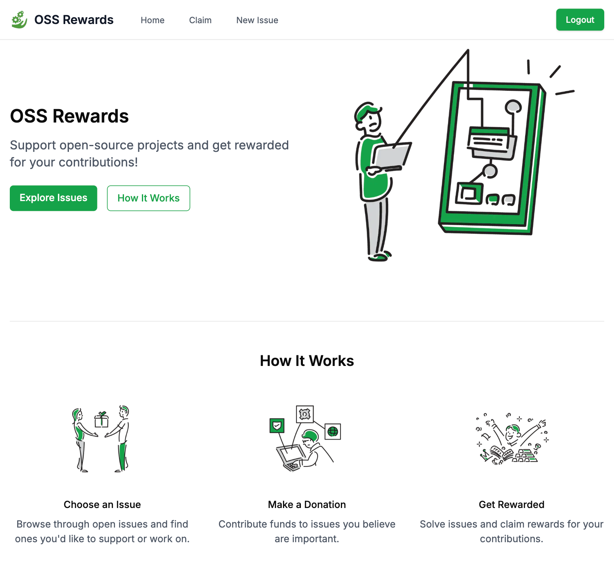
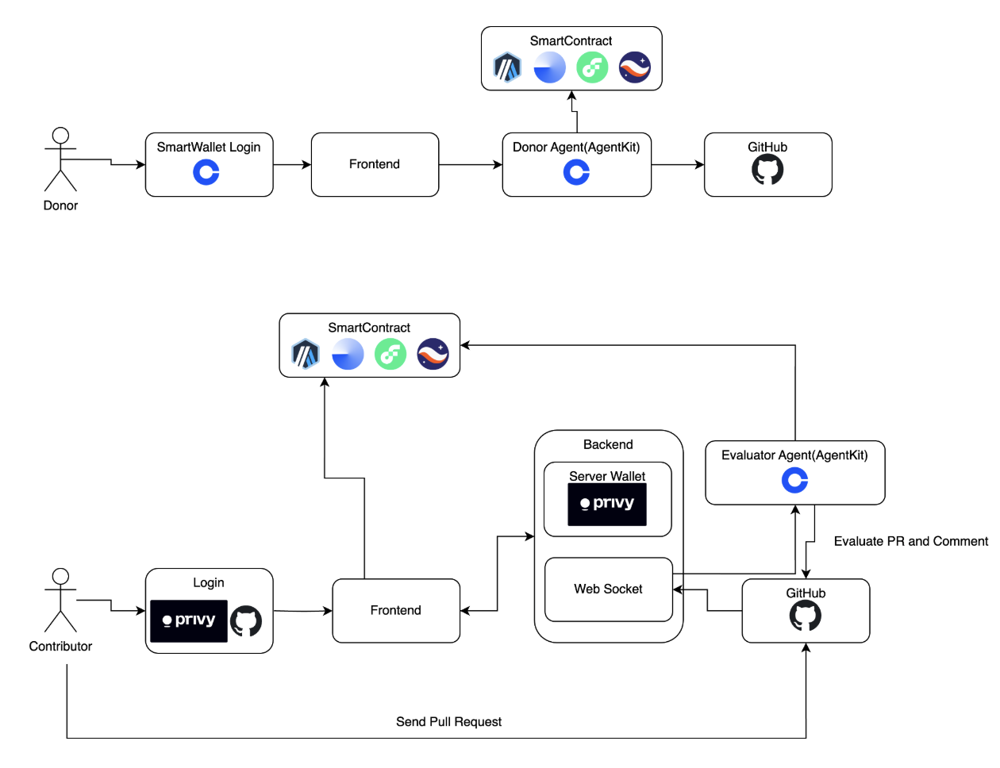

# OSS-Rewards-Agent



## Overview

OSS-Rewards-Agent is a groundbreaking open source support project that matches contributors with open source projects facing issues, where AI Agents facilitate reward payments to contributors.

## How It Works

1. **Issue Creation**
   - Open source developers or users can create issues with attached cryptocurrency rewards
   - These issues represent improvements or fixes needed in the project

2. **Contributor Matching**
   - Contributors can search through reward-linked issues
   - They can work on issues that match their skills and interests

3. **Reward Distribution**
   - Upon successful merge of a pull request, an AI Agent sends a reward claim link
   - Authentication through GitHub account is required to claim rewards
   - Only contributors whose pull requests are merged can claim the reward for the corresponding issue

## System Architecture



## Contract Addresses

- **Base Sepolia**: `0xd7bc036902663b801a90aFf0511E2D2553f996d0`
- **Arbitrum Sepolia**: `0x68F5333416fFF0Dce00e9a10384fD54A6986cAe1`

## Security Features

The system ensures secure reward distribution through:
- GitHub account authentication requirement
- Verification that only the contributor whose pull request was merged can claim the reward
- Automated validation of contribution completion

## Directory
```
.
├── backend        # Implementation related to donor agent, donation agent, and GitHub monitoring
├── contracts      # Implementation of lock_reward and claimReward
├── frontend       # Frontend implementation
├── public         # Documentation and resources
├── README.md      # Overview of this project
```